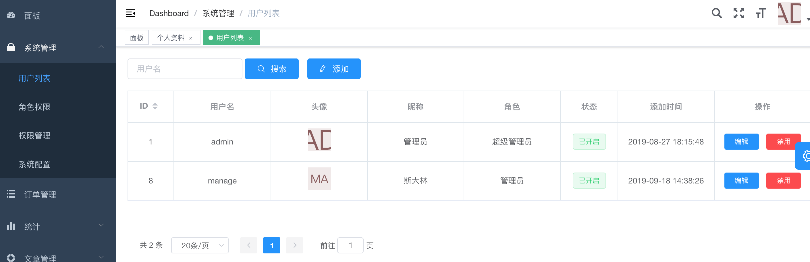
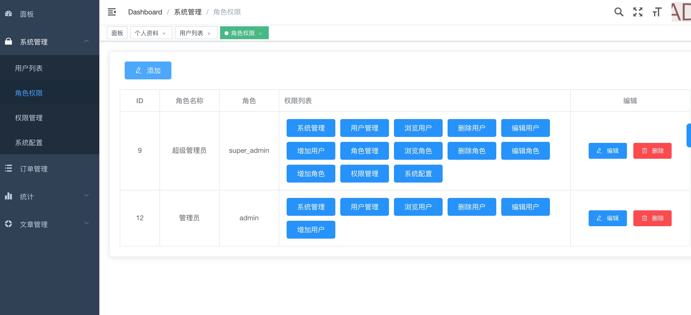
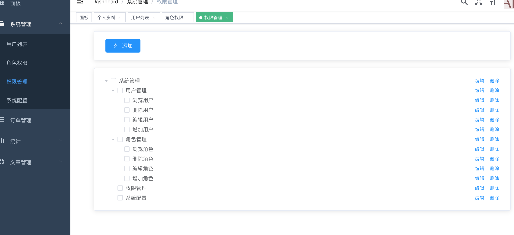

#hyperf-rbac
##介绍

    快速实现基于hyperf 的 后台管理 
    
    已实现功能：
    
    token登陆验证
    
    RBAC权限管理
    
    头像自动生成
    
    element-admin 管理端
    
##预览

##安装教程
    环境要求：
    swoole 4.4.3
    php 7.2
    php.ini 下面添加
    swoole.use_shortname = 'Off'
    导入根目录下面的hrabac.sql文件
    
    修改.env 配置
    
    管理端采用element-admin开发
    
    cd admin 
    
    执行yarn
    
    npm  run dev    
    
    
#hyperf 命令工具

    Options:
      -h, --help            Display this help message
      -q, --quiet           Do not output any message
      -V, --version         Display this application version
          --ansi            Force ANSI output
          --no-ansi         Disable ANSI output
      -n, --no-interaction  Do not ask any interactive question
      -v|vv|vvv, --verbose  Increase the verbosity of messages: 1 for normal output, 2 for more verbose output and 3 for debug
    
    Available commands:
      help               Displays help for a command
      info               Dump the server info.
      list               Lists commands
      migrate            
      start              Start swoole server.
     db
      db:model           
     di
      di:init-proxy      
     gen
      gen:amqp-consumer  Create a new amqp consumer class
      gen:amqp-producer  Create a new amqp producer class
      gen:aspect         Create a new aspect class
      gen:command        Create a new command class
      gen:controller     Create a new controller class
      gen:job            Create a new job class
      gen:listener       Create a new listener class
      gen:middleware     Create a new middleware class
      gen:migration      
      gen:process        Create a new process class
     migrate
      migrate:fresh      
      migrate:install    
      migrate:refresh    
      migrate:reset      
      migrate:rollback   
      migrate:status     
     vendor
      vendor:publish     Publish any publishable configs from vendor packages.
      
##使用的第三方包

    "firebase/php-jwt": "^5.0",             jwt包
    "lasserafn/php-initial-avatar-generator": "^4.0"  头像生成
 